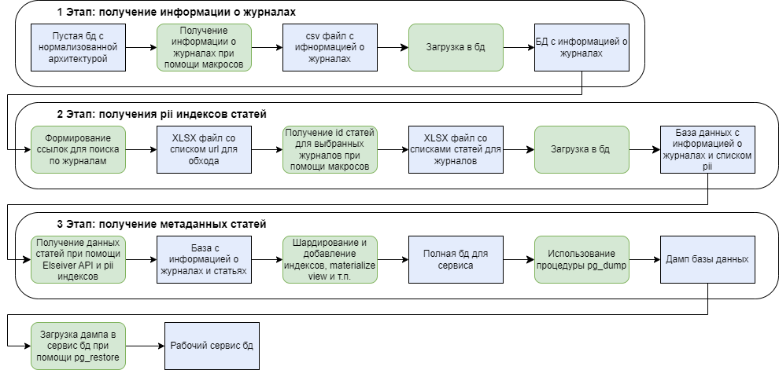
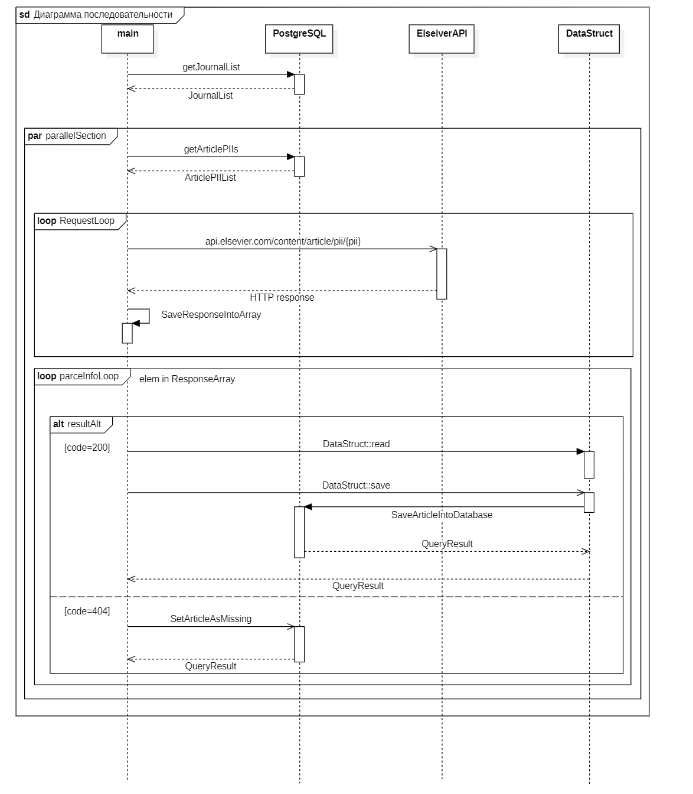
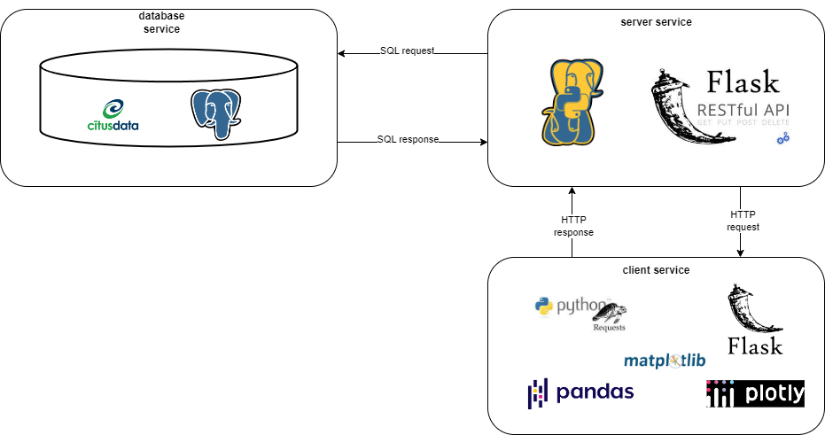

[На страницу с документацией](README.md)
# Описание архитектуры
## Стратегия сбора данных
С целью сбора большого числа статей была реализована 3-х этапная процедура по сбору данных:
1. Получение информации о журналах
2. Получение списков pii индексов статей для журналов
3. Получение метаданных статей по их pii индексам

## 1-2 Этап
Ввиду многих ограничений данные собирались при помощи макросов.

Поскольку число журналов менее подвержено изменениям, датасет с ними можно считать окончательным.

При написании макросов использовалось ПО Macro Recorder Enterprise v3.0.40.
## 3 Этап
Для получения информации о журналах была реализована параллельная программа, которая асинхронно обращается к API сайта.
Программу можно приблизительно описать диаграммой ниже:

Cтек технологий:
- IDE: Clion 2023.2
- Система сборки: cmake-3.20
- Стандарт языка: 17 
- Установленные библиотеки:
  - libopenmp v5.0 
  - libpqxx v7.8.1 
  - libcpr v1.10.2 
  - pugixml v1.14

## Сервисы для анализа данных
Для выполнения аналитики было реализовано следующее решение. 

Стек технологий:
- IDE: Pycharm v2023.2
- База данных: PostgreSQL v16.1 с расширением Citus-data 12.1
- Язык программирования: Python v3.11.7
- Библиотеки сервиса REST:
  - pandas v2.1.3
  - Flask v3.0.0 
  - psycopg2 v2.9.9 
  - Flask-RESTful v0.3.10 
  - waitress 2.1.2
- Библиотеки сервиса визуализации данных:
  - pandas v2.1.3
  - matplotlib v3.8.2
  - matplotlib-venn v0.11.9
  - plotly v5.18.0 
  - dash v2.14.2 
  - requests v2.31.0 
  - scipy v1.11.4 
  - Flask v3.0.0
  - waitress 2.1.2

Все указанные сервисы упакованы в Docker образы [Docker Hub](https://hub.docker.com/repository/docker/alexandermey/data_analytic_project).